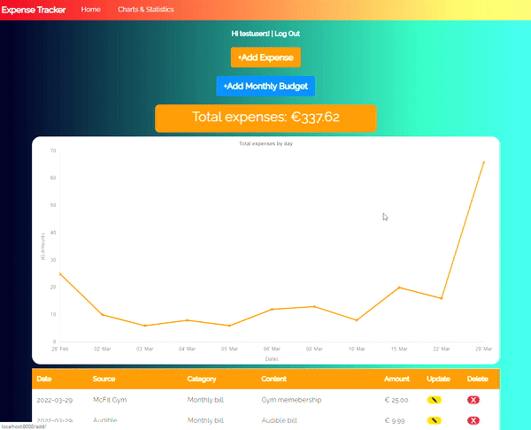

# Expense Tracker

Expense Tracker will help you track, have charts on and statistics about your expenses.

## Usage

### Adding Expenses
You can add an expense by clicking the "Add Expense" button, filling and submitting the expense form.

Once you've added the expense it will be reflected on the total expenses element, the homepage's line chart and will also be listed below on the expenses table.

**Note:**  
*Line chart will only appear if you have 2 or more expenses added.*

### Adding Monthly Budget
You can add a monthly budget by clicking the 
Add Monthly Budget button, filling and submitting the form. 

Once you've added it the budget UI will be displayed, including the budget progress bar, the monthly budget next to the expenses of the current month and the edit and delete buttons.

### Checking Charts & Statistics
Finally you can access charts and statistics about your expenses by navigating to the Charts & Statistics section.

Here you can find expense charts with amounts grouped by month and week, as well as total and monthly expenses grouped by categories.

You can find your current monthly expenses (with controls for editing or deleting budget here too), as well as last month expenses and statistics like monthly expense average, daily expense average, current vs last month expense percetange difference and more.

 

### Credentials ###   
username: testuser1  
password: testpass1

You can check the app (please wait a bit for a free dyno to start) [here](https://expense-tracker16.herokuapp.com/).

 

## Installation

   For installing the Django application clone the repository and run:

     pipenv install

   This will install the virtual environments and all dependencies.
   
   Now start the virtual environment shell:
    
     pipenv shell
   

**Note:**  
*Make sure you have 'DEVELOPMENT' set to True in your environment variables, in case you want to use the sqlite db.
Or if you want to use postgres set DB_NAME, DB_USER, DB_PASSWORD on your environment variables, otherwise psycopg2 will throw an error.*

   Run migrations: 
	
    python manage.py makemigrations
    python manage.py migrate

   Create superuser:

    python manage.py createsuperuser
     
For installing Cypress run go to the e2e folder and run:

    npm install
And then

    npx cypress open

## Running tests

### Unit tests

    python manage.py test

### E2E tests
For running the tests run:

    npm run test
For running the tests on headless mode run:

    npm run test:headless
For opening cypress client run:

    npm run test:open
    
## Uses
 - Django.
 - Postgres.
 - Bootstrap.
 - Chart.js.
 - Cypress.

## Features
- Expense list.
- Expense charts.
- Monthly budget bar.
- Statistics table.
- Authentication.
- Form validation.
- Pagination.
- UI tests.
- Visual tests.
- Unit tests.

